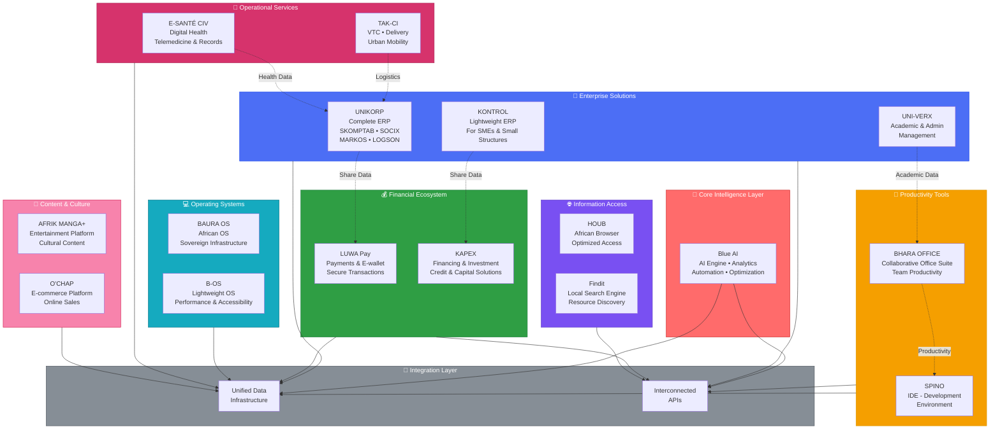

# INNOV'KORP Ecosystem Architecture

## Overview

INNOV'KORP is an integrated African digital ecosystem designed to achieve technological sovereignty. This diagram illustrates how all components work together as a cohesive system.



## Ecosystem Pillars

### 1. **🧠 Core Intelligence** - Blue AI
- **Role**: Analytical engine of the entire ecosystem
- **Functions**: Data analysis, automation, optimization
- **Impact**: Powers all solutions with intelligent capabilities

### 2. **🏢 Enterprise Solutions** - ERP Foundation
- **UNIKORP**: Complete ERP for large & medium enterprises
- **KONTROL**: Lightweight ERP for SMEs and small structures  
- **UNI-VERX**: Academic & administrative management
- **Purpose**: Structured organizations, reliable data generation

### 3. **💰 Financial Ecosystem** - Economic Control
- **LUWA Pay**: Secure payments & electronic wallet
- **KAPEX**: Financing, investment & credit solutions
- **Purpose**: Control financial flows locally

### 4. **📱 Productivity Tools** - Operational Acceleration
- **BHARA OFFICE**: Collaborative office suite
- **SPINO**: Integrated Development Environment
- **Purpose**: Accelerate digital tool creation

### 5. **🌐 Information Access** - Digital Sovereignty
- **HOUB**: Optimized African browser
- **Findit**: Local search engine
- **Purpose**: Control access to digital resources

### 6. **💻 Operating Systems** - Infrastructure
- **BAURA OS**: Full African operating system
- **B-OS**: Lightweight OS for performance
- **Purpose**: Reduce foreign environment dependence

### 7. **🏥 Operational Services** - Direct Impact
- **E-SANTÉ CIV**: Digital health platform & telemedicine
- **TAK-CI**: Urban mobility, VTC & delivery logistics
- **Purpose**: Direct impact on daily usage

### 8. **🎨 Content & Culture** - Complete Ecosystem
- **AFRIK MANGA+**: Entertainment & cultural platform
- **O'CHAP**: Integrated e-commerce platform
- **Purpose**: Cultural & digital completeness

## Integration Strategy

### Data Infrastructure
- **Unified Data Layer**: All solutions share a common data infrastructure
- **Blue AI**: Analyzes cross-solution data for optimization
- **Real-time Sync**: Changes in one solution propagate across the ecosystem

### Interconnected APIs
- **API Gateway**: Manages communication between solutions
- **Seamless Integration**: Solutions work together as one system
- **Scalability**: Easy to add new solutions to the ecosystem

### Synergies
- **ERP ↔ Finance**: Business data flows to financial tools
- **ERP ↔ Logistics**: Operational data flows to TAK-CI
- **Health ↔ ERP**: Medical records integrate with business systems
- **Productivity ↔ All**: BHARA OFFICE & SPINO support all solutions

## Strategic Positioning

```
INNOV'KORP = Infrastructure Builder + Sovereignty Actor + Solutions Integrator

From: Dependent Users with Foreign Systems
To:    Masters of Integrated African Digital Infrastructure
```

---

**Mission**: Build an integrated African digital infrastructure capable of reducing technological dependence while offering powerful, adapted, and accessible solutions.

**Vision**: Reclaim digital control on the continent through a cohesive ecosystem where each product integrates into a larger whole.
