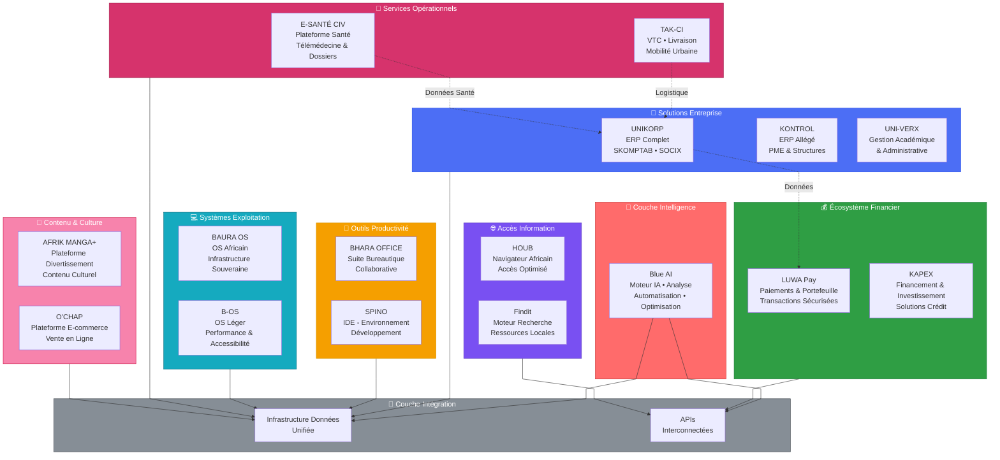
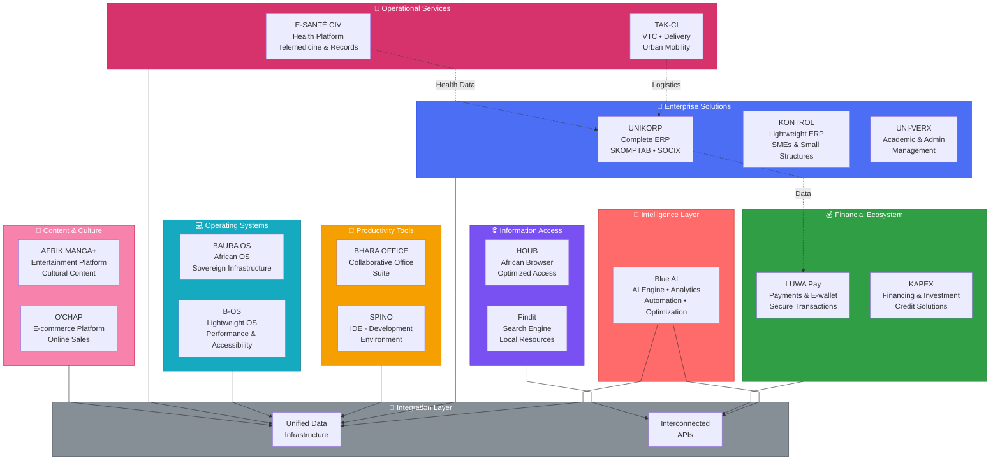
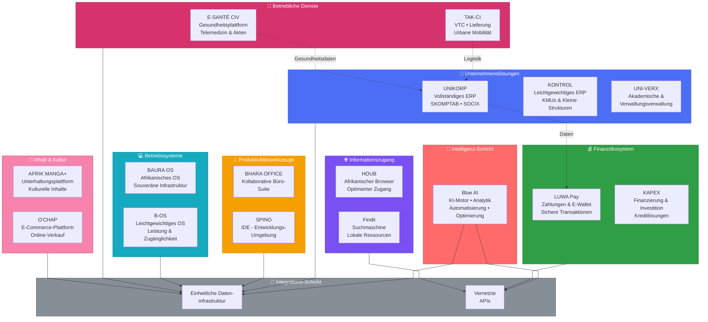
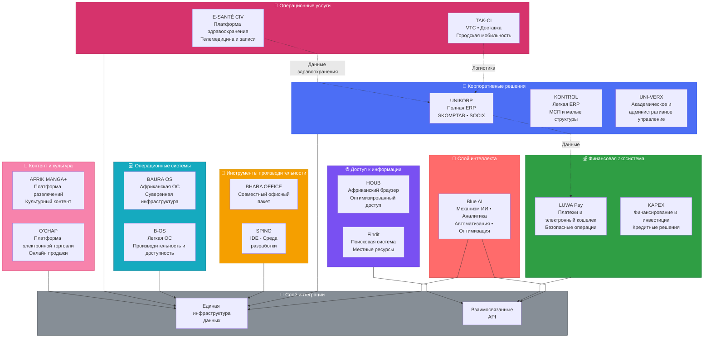
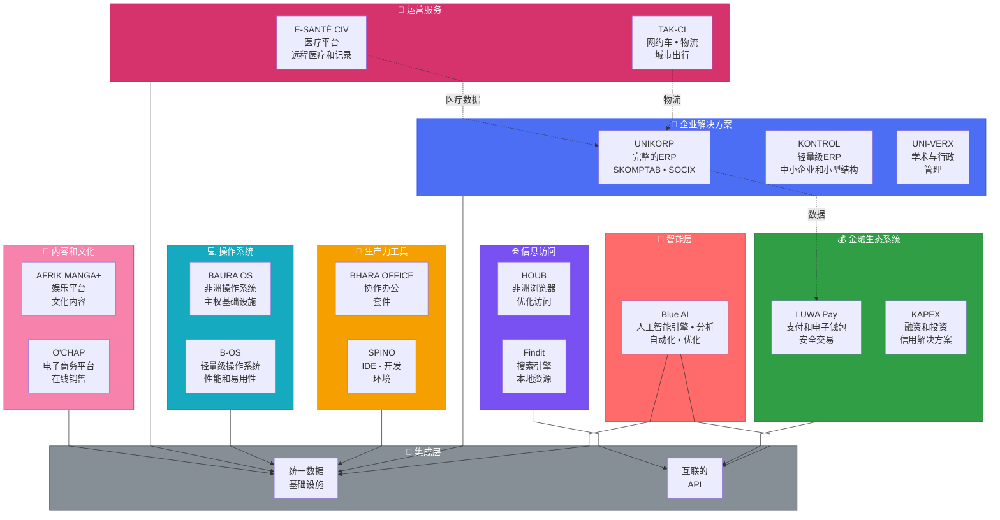

<strong>🇫🇷 FRANÇAIS</strong>

# Ahmed Silué - Bryant273 👋

Bienvenue sur mon profil GitHub ! Je suis **Fondateur et CEO de INNOV'KORP**, une startup pionnière dédiée à la **souveraineté technologique africaine**. Je suis aussi un **vibe-coder** passionné par la technologie et l'entrepreneuriat.

## 🏗️ Architecture INNOV'KORP - Écosystème Intégré

## 🌍 À Propos de Moi

Je crois que l'Afrique mérite de reprendre le contrôle de son infrastructure numérique. Sans être codeur traditionnel, j'ai acquis une compréhension profonde des principes du développement et de l'architecture en utilisant l'IA pour du prototypage rapide.

Ma formation diversifiée en **gestion, finance et logistique** me permet de comprendre les vrais besoins des entreprises africaines. Mon expérience en comptabilité m'a montré que nos systèmes financiers et opérationnels sont trop dépendants des solutions étrangères.

En tant que CEO d'INNOV'KORP, je combine :
- 📊 **Expertise métier** - Gestion, finance, logistique
- 🧠 **Vision stratégique** - Souveraineté technologique africaine
- 🤖 **Innovation IA** - Prototypage rapide et itération intelligente
- 🔗 **Pensée systémique** - Construire un écosystème, pas des solutions isolées

## 🏢 INNOV'KORP - L'Écosystème Numérique Africain

**Mission :** Construire une infrastructure numérique africaine intégrée, capable de réduire la dépendance technologique et offrir des solutions performantes, adaptées et accessibles.

### Le Constat
Aujourd'hui, les entreprises africaines fonctionnent avec :
- ❌ Des logiciels étrangers coûteux
- ❌ Des infrastructures externes non maîtrisées
- ❌ Des systèmes inadaptés aux réalités locales
- ❌ Une faible maîtrise des données

**Résultat :** dépendance technologique, coûts élevés, solutions inadaptées.

### Notre Vision
✨ Reprendre le contrôle du digital sur le continent en construisant un écosystème cohérent où chaque produit s'intègre dans un ensemble plus large.

### 🏗️ L'Écosystème INNOV'KORP

| Pilier | Solutions | Objectif |
|--------|-----------|----------|
| **1. ERP & Gestion** | UNIKORP, KONTROL, UNI-VERX | Structurer les organisations, générer des données fiables |
| **2. Intelligence IA** | Blue AI | Analyser, automatiser, optimiser l'écosystème |
| **3. Finance** | LUWA Pay, KAPEX | Maîtriser les flux financiers localement |
| **4. Productivité** | BHARA OFFICE, SPINO | Accélérer la création d'outils numériques |
| **5. Accès Information** | HOUB, Findit | Contrôler l'accès aux ressources digitales |
| **6. Systèmes d'Exploitation** | BAURA OS, B-OS | Réduire la dépendance aux environnements étrangers |
| **7. Services Opérationnels** | TAK-CI, E-SANTÉ CIV | Impact direct sur les usages quotidiens |
| **8. Contenu** | AFRIK MANGA+, O'CHAP | Écosystème culturel et numérique complet |

### Positionnement
INNOV'KORP se positionne comme :
- 🏗️ Un **constructeur d'infrastructure digitale**
- 🛡️ Un **acteur de souveraineté technologique**
- 🔌 Un **intégrateur de solutions interconnectées**

## 💼 Ce Que Je Fais

- 🔮 **Prototypage IA-Driven** - De l'idée au MVP en un temps record
- 📈 **Stratégie produit** - Diriger INNOV'KORP vers une croissance exponentielle
- 🏛️ **Architecture écosystémique** - Concevoir des solutions intégrées et scalables
- 💡 **Innovation technologique** - Penser africain, agir global
- 🤝 **Leadership & Partenariats** - Construire des synergies pour l'impact

## 🎓 Formation

- 🎯 **Master** - Finance & Comptabilité
- 📚 **Licence** - Gestion des PME
- 🚚 **BTS** - Transport & Logistique

*Actuellement : Comptable | Transition vers le plein temps en tant que Founder & CEO*

## 🛠️ Tech Stack Préféré

**Stack Backend & Infrastructure :**
- **Backend** : Spring (Java)
- **Système, sécurité interne et communication DB** : Rust
- **Gateway et performance** : Go
- **Données** : PostgreSQL

**Stack Frontend Web :**
- **Frontend Principal** : Angular
- **Frontend Prototypage Rapide** : React
- **Amplificateur** : IA & No-Code

**Stack Mobile Multiplateforme :**
- 📱 **Flutter** (iOS, Android, Web, Desktop)
- 🔶 **React Native** (iOS, Android)
- 💙 **Kotlin** (Android natif)
- 🍎 **Swift** (iOS natif)
- ⚡ **Ionic** (iOS, Android, Progressive Web Apps)

## 🌟 Cofondateurs

INNOV'KORP a été fondée par une équipe complémentaire de visionnaires :

- **SILUÉ AHMED** (CEO) - Fondateur et visionnaire | Stratégie globale, direction générale
- **DIALI EVAN'S** (Directeur Marketing & Communication) - Stratégie marketing | Positionnement de marque, communication d'impact
- **BITADA EMMANUEL** (Directeur Informatique et Développement) - Architecture technique | Leadership du développement, infrastructure
- **HABIB KONÉ** (Chargé du Portefeuille Relationnel) - Relations stratégiques | Partenariats clés, écosystème d'affaires

## 🚀 Nous Recrutons !

**INNOV'KORP est en forte croissance et nous recherchons activement des développeurs talentueux !**

### Qui cherchons-nous ?
Des développeurs maîtrisant nos stacks de prédilection : Spring/Java, Rust, Go, PostgreSQL, Angular, React, Flutter, React Native, Kotlin, Swift, Ionic

### Pourquoi nous rejoindre ?
- 🌍 Contribuer à la **souveraineté technologique africaine**
- 💡 Travailler sur des projets **d'impact continental**
- 💰 **Bonne rémunération à long terme possible**
- 🚀 Opportunités d'évolution rapide dans une startup en croissance exponentielle
- 🤝 Travailler aux côtés d'une équipe de fondateurs visionnaires
- 🎯 Construire ensemble l'infrastructure numérique du continent
- 📈 Être part d'une aventure qui crée de la richesse collective

### 📮 Intéressé(e) ?
Contactez-moi directement pour discuter des opportunités et rejoindre cette aventure !

## 📊 GitHub Stats

## 💬 Philosophie

> "INNOV'KORP ne cherche pas simplement à innover. L'entreprise cherche à rééquilibrer le pouvoir technologique. Passer de **utilisateurs dépendants** à **acteurs maîtres de leurs systèmes**."

Je crois que :
- 🌍 L'Afrique a le potentiel pour construire ses propres solutions technologiques
- 🤖 L'IA démocratise l'innovation et l'entrepreneuriat tech
- 🔗 Les écosystèmes intégrés créent plus de valeur que des solutions isolées
- 💡 Les vrais innovateurs comprennent les besoins du terrain

---

⭐️ Si vous croyez en la souveraineté technologique africaine, si vous travaillez sur l'innovation en Afrique, ou si vous avez des idées pour INNOV'KORP, parlons ! 🚀

**Rejoignons la révolution numérique africaine.**

## 🌐 Connectez-Vous Avec Moi

- 💼 [LinkedIn](https://www.linkedin.com/in/silueahmed273)
- 📧 Email personnel : silueahmed273@gmail.com
- 📧 Email entreprise : innov.korp@gmail.com

<strong>🇬🇧 ENGLISH</strong>

# Ahmed Silué - Bryant273 👋

Welcome to my GitHub profile! I am **Founder and CEO of INNOV'KORP**, a pioneering startup dedicated to **African technological sovereignty**. I'm also a **vibe-coder** passionate about technology and entrepreneurship.

## 🏗️ INNOV'KORP Architecture - Integrated Ecosystem

## 🌍 About Me

I believe Africa deserves to regain control of its digital infrastructure. Though not a traditional coder, I've gained a deep understanding of software development and architecture principles by using AI for rapid prototyping.

My diverse background in **management, finance, and logistics** allows me to understand the real needs of African businesses. My accounting experience has shown me that our financial and operational systems are too dependent on foreign solutions.

As CEO of INNOV'KORP, I combine:
- 📊 **Domain Expertise** - Management, finance, logistics
- 🧠 **Strategic Vision** - African technological sovereignty
- 🤖 **AI Innovation** - Rapid prototyping and intelligent iteration
- 🔗 **Systems Thinking** - Building an ecosystem, not isolated solutions

## 🏢 INNOV'KORP - African Digital Ecosystem

**Mission:** Build an integrated African digital infrastructure, capable of reducing technological dependence and offering powerful, adapted, and accessible solutions.

### The Challenge
Today, African businesses operate with:
- ❌ Expensive foreign software
- ❌ Uncontrolled external infrastructure
- ❌ Systems poorly adapted to local realities
- ❌ Poor data control

**Result:** technological dependence, high costs, inappropriate solutions.

### Our Vision
✨ Reclaim digital control on the continent by building a coherent ecosystem where each product integrates into a larger whole.

### 🏗️ INNOV'KORP Ecosystem

| Pillar | Solutions | Objective |
|--------|-----------|----------|
| **1. ERP & Management** | UNIKORP, KONTROL, UNI-VERX | Structure organizations, generate reliable data |
| **2. AI Intelligence** | Blue AI | Analyze, automate, optimize the ecosystem |
| **3. Finance** | LUWA Pay, KAPEX | Control financial flows locally |
| **4. Productivity** | BHARA OFFICE, SPINO | Accelerate digital tool creation |
| **5. Information Access** | HOUB, Findit | Control access to digital resources |
| **6. Operating Systems** | BAURA OS, B-OS | Reduce dependence on foreign environments |
| **7. Operational Services** | TAK-CI, E-SANTÉ CIV | Direct impact on daily usage |
| **8. Content** | AFRIK MANGA+, O'CHAP | Complete cultural and digital ecosystem |

### Positioning
INNOV'KORP positions itself as:
- 🏗️ A **digital infrastructure builder**
- 🛡️ An **actor for technological sovereignty**
- 🔌 An **interconnected solutions integrator**

## 💼 What I Do

- 🔮 **AI-Driven Prototyping** - From idea to MVP in record time
- 📈 **Product Strategy** - Direct INNOV'KORP toward exponential growth
- 🏛️ **Ecosystem Architecture** - Design integrated and scalable solutions
- 💡 **Technological Innovation** - Think African, act global
- 🤝 **Leadership & Partnerships** - Build synergies for impact

## 🎓 Education

- 🎯 **Master's** - Finance & Accounting
- 📚 **Bachelor's** - SME Management
- 🚚 **BTS** - Transport & Logistics

*Currently: Accountant | Transitioning to full-time as Founder & CEO*

## 🛠️ Preferred Tech Stack

**Backend & Infrastructure:**
- **Backend**: Spring (Java)
- **System, internal security and DB communication**: Rust
- **Gateway and performance**: Go
- **Data**: PostgreSQL

**Frontend Web Stack:**
- **Primary Frontend**: Angular
- **Rapid Prototyping Frontend**: React
- **Amplifier**: AI & No-Code

**Cross-Platform Mobile Stack:**
- 📱 **Flutter** (iOS, Android, Web, Desktop)
- 🔶 **React Native** (iOS, Android)
- 💙 **Kotlin** (Android native)
- 🍎 **Swift** (iOS native)
- ⚡ **Ionic** (iOS, Android, Progressive Web Apps)

## 🌟 Co-founders

INNOV'KORP was founded by a complementary team of visionaries:

- **SILUÉ AHMED** (CEO) - Founder and visionary | Global strategy, general direction
- **DIALI EVAN'S** (Marketing Director & Communication) - Marketing strategy | Brand positioning, impact communication
- **BITADA EMMANUEL** (IT Director and Development) - Technical architecture | Development leadership, infrastructure
- **HABIB KONÉ** (Relationship Portfolio Manager) - Strategic relationships | Key partnerships, business ecosystem

## 🚀 We're Hiring!

**INNOV'KORP is growing rapidly and actively seeking talented developers!**

### Who are we looking for?
Developers proficient with our preferred stacks: Spring/Java, Rust, Go, PostgreSQL, Angular, React, Flutter, React Native, Kotlin, Swift, Ionic

### Why Join Us?
- 🌍 Contribute to **African technological sovereignty**
- 💡 Work on projects with **continental impact**
- 💰 **Good long-term compensation potential**
- 🚀 Rapid evolution opportunities in an exponentially growing startup
- 🤝 Work alongside a visionary founding team
- 🎯 Build the continent's digital infrastructure together
- 📈 Be part of an adventure that creates collective wealth

### 📮 Interested?
Contact me directly to discuss opportunities and join this adventure!

## 📊 GitHub Stats

## 💬 Philosophy

> "INNOV'KORP doesn't just seek to innovate. The company seeks to rebalance technological power. Moving from **dependent users** to **masters of their systems**."

I believe that:
- 🌍 Africa has the potential to build its own technological solutions
- 🤖 AI democratizes innovation and tech entrepreneurship
- 🔗 Integrated ecosystems create more value than isolated solutions
- 💡 True innovators understand grassroots needs

---

⭐️ If you believe in African technological sovereignty, work on innovation in Africa, or have ideas for INNOV'KORP, let's talk! 🚀

**Let's join the African digital revolution.**

## 🌐 Connect With Me

- 💼 [LinkedIn](https://www.linkedin.com/in/silueahmed273)
- 📧 Personal Email: silueahmed273@gmail.com
- 📧 Business Email: innov.korp@gmail.com

<strong>🇩🇪 DEUTSCH</strong>

# Ahmed Silué - Bryant273 👋

Willkommen auf meinem GitHub-Profil! Ich bin **Gründer und CEO von INNOV'KORP**, einem bahnbrechenden Startup für **afrikanische technologische Souveränität**. Ich bin auch ein **Vibe-Coder**, der leidenschaftlich gerne an Technologie und Unternehmertum arbeitet.

## 🏗️ INNOV'KORP Architektur - Integriertes Ökosystem

## 🌍 Über Mich

Ich glaube, dass Afrika die Kontrolle über seine digitale Infrastruktur zurückgewinnen sollte. Obwohl ich kein traditioneller Programmierer bin, habe ich durch die Verwendung von KI für schnelle Prototypenentwicklung ein tiefes Verständnis der Softwareentwicklungs- und Architekturprinzipien erworben.

Mein vielfältiger Hintergrund in **Management, Finanzen und Logistik** ermöglicht es mir, die realen Anforderungen afrikanischer Unternehmen zu verstehen. Meine Rechnungswesenerfahrung hat mir gezeigt, dass unsere Finanz- und Betriebssysteme zu sehr von ausländischen Lösungen abhängig sind.

Als CEO von INNOV'KORP kombiniere ich:
- 📊 **Fachwissen** - Management, Finanzen, Logistik
- 🧠 **Strategische Vision** - Afrikanische technologische Souveränität
- 🤖 **KI-Innovation** - Schnelles Prototyping und intelligente Iteration
- 🔗 **Systemdenken** - Aufbau eines Ökosystems, nicht isolierter Lösungen

## 🏢 INNOV'KORP - Afrikanisches digitales Ökosystem

**Mission:** Aufbau einer integrierten afrikanischen digitalen Infrastruktur, die in der Lage ist, die technologische Abhängigkeit zu verringern und starke, angepasste und zugängliche Lösungen anzubieten.

### Die Herausforderung
Heute arbeiten afrikanische Unternehmen mit:
- ❌ Teurer ausländischer Software
- ❌ Unkontrollierter externer Infrastruktur
- ❌ Systemen, die schlecht an lokale Realitäten angepasst sind
- ❌ Schlechter Datenkontrolle

**Ergebnis:** technologische Abhängigkeit, hohe Kosten, ungeeignete Lösungen.

### Unsere Vision
✨ Digitale Kontrolle auf dem Kontinent zurückgewinnen durch den Aufbau eines kohärenten Ökosystems, in dem sich jedes Produkt in ein größeres Ganzes einfügt.

### 🏗️ INNOV'KORP Ökosystem

| Säule | Lösungen | Ziel |
|--------|-----------|----------|
| **1. ERP & Management** | UNIKORP, KONTROL, UNI-VERX | Strukturorganisationen, zuverlässige Daten generieren |
| **2. KI-Intelligenz** | Blue AI | Ökosystem analysieren, automatisieren, optimieren |
| **3. Finanzen** | LUWA Pay, KAPEX | Finanzflüsse lokal kontrollieren |
| **4. Produktivität** | BHARA OFFICE, SPINO | Digitale Werkzeugentwicklung beschleunigen |
| **5. Informationszugang** | HOUB, Findit | Zugriff auf digitale Ressourcen kontrollieren |
| **6. Betriebssysteme** | BAURA OS, B-OS | Abhängigkeit von fremden Umgebungen verringern |
| **7. Betriebliche Dienste** | TAK-CI, E-SANTÉ CIV | Direkte Auswirkung auf die tägliche Nutzung |
| **8. Inhalt** | AFRIK MANGA+, O'CHAP | Vollständiges Kultur- und Digitalökosystem |

### Positionierung
INNOV'KORP positioniert sich als:
- 🏗️ Ein **Erbauer digitaler Infrastruktur**
- 🛡️ Ein **Akteur für technologische Souveränität**
- 🔌 Ein **Integrator vernetzter Lösungen**

## 💼 Was ich tue

- 🔮 **KI-gestütztes Prototyping** - Von der Idee zum MVP in Rekordzeit
- 📈 **Produktstrategie** - INNOV'KORP zu exponentiellem Wachstum führen
- 🏛️ **Ökosystem-Architektur** - Integrierte und skalierbare Lösungen entwerfen
- 💡 **Technologische Innovation** - Afrika denken, global handeln
- 🤝 **Führung & Partnerschaften** - Synergien für Impact aufbauen

## 🎓 Bildung

- 🎯 **Master** - Finanzen & Rechnungswesen
- 📚 **Bachelor** - KMU-Management
- 🚚 **BTS** - Transport & Logistik

*Aktuell: Rechnungsführer | Übergang zur Vollzeitarbeit als Gründer & CEO*

## 🛠️ Bevorzugter Tech Stack

**Backend & Infrastruktur:**
- **Backend**: Spring (Java)
- **System, interne Sicherheit und Datenbankkommunikation**: Rust
- **Gateway und Leistung**: Go
- **Daten**: PostgreSQL

**Frontend Web Stack:**
- **Primäres Frontend**: Angular
- **Schnelles Prototyping Frontend**: React
- **Verstärker**: KI & No-Code

**Plattformübergreifender Mobile Stack:**
- 📱 **Flutter** (iOS, Android, Web, Desktop)
- 🔶 **React Native** (iOS, Android)
- 💙 **Kotlin** (Android natürlich)
- 🍎 **Swift** (iOS natürlich)
- ⚡ **Ionic** (iOS, Android, Progressive Web Apps)

## 🌟 Mitgründer

INNOV'KORP wurde von einem komplementären Team von Visionären gegründet:

- **SILUÉ AHMED** (CEO) - Gründer und Visionär | Globale Strategie, Gesamtleitung
- **DIALI EVAN'S** (Marketing- und Kommunikationsdirektor) - Marketingstrategie | Markenpositionierung, Impact-Kommunikation
- **BITADA EMMANUEL** (IT-Direktor und Entwicklung) - Technische Architektur | Entwicklungsleitung, Infrastruktur
- **HABIB KONÉ** (Relationship Portfolio Manager) - Strategische Beziehungen | Schlüsselpartnerschaften, Geschäftsökosystem

## 🚀 Wir stellen ein!

**INNOV'KORP wächst schnell und sucht aktiv nach talentierten Entwicklern!**

### Wen suchen wir?
Entwickler mit Kenntnissen in unseren bevorzugten Stacks: Spring/Java, Rust, Go, PostgreSQL, Angular, React, Flutter, React Native, Kotlin, Swift, Ionic

### Warum uns beitreten?
- 🌍 Zum **technologischen Souveränität Afrikas** beitragen
- 💡 An Projekten mit **kontinentaler Auswirkung** arbeiten
- 💰 **Gutes Langfristvergütungspotenzial**
- 🚀 Schnelle Entwicklungsmöglichkeiten in einem exponentiell wachsenden Startup
- 🤝 Neben einem visionären Gründungsteam arbeiten
- 🎯 Zusammen die digitale Infrastruktur des Kontinents aufbauen
- 📈 Teil eines Abenteuers sein, das kollektiven Wohlstand schafft

### 📮 Interessiert?
Kontaktieren Sie mich direkt, um Möglichkeiten zu besprechen und dieses Abenteuer zu beginnen!

## 📊 GitHub Stats

## 💬 Philosophie

> "INNOV'KORP strebt nicht nur nach Innovation. Das Unternehmen versucht, die technologische Macht neu auszugleichen. Vom **abhängigen Benutzer** zum **Meister seines Systems**."

Ich glaube, dass:
- 🌍 Afrika das Potenzial hat, seine eigenen technologischen Lösungen aufzubauen
- 🤖 KI Innovation und Tech-Unternehmertum demokratisiert
- 🔗 Integrierte Ökosysteme mehr Wert schaffen als isolierte Lösungen
- 💡 Wahre Innovatoren verstehen lokale Anforderungen

---

⭐️ Wenn Sie an afrikanischer technologischer Souveränität glauben, an Innovation in Afrika arbeiten oder Ideen für INNOV'KORP haben, lass uns reden! 🚀

**Lassen Sie uns der afrikanischen digitalen Revolution beitreten.**

## 🌐 Kontakt mit mir

- 💼 [LinkedIn](https://www.linkedin.com/in/silueahmed273)
- 📧 Persönliche E-Mail: silueahmed273@gmail.com
- 📧 Geschäfts-E-Mail: innov.korp@gmail.com

<strong>🇷🇺 РУССКИЙ</strong>

# Ahmed Silué - Bryant273 👋

Добро пожаловать на мой профиль GitHub! Я **основатель и генеральный директор INNOV'KORP**, инновационной компании, посвященной **африканскому технологическому суверенитету**. Я также **вибе-кодер**, увлеченный технологиями и предпринимательством.

## 🏗️ Архитектура INNOV'KORP - Интегрированная экосистема

## 🌍 Обо мне

Я верю, что Африка должна вернуть контроль над своей цифровой инфраструктурой. Хотя я не традиционный программист, я приобрел глубокое понимание принципов разработки и архитектуры программного обеспечения благодаря использованию ИИ для быстрого прототипирования.

Мой разнообразный опыт в области **управления, финансов и логистики** позволяет мне понять реальные потребности африканских предприятий. Мой опыт в бухгалтерском учете показал мне, что наши финансовые и операционные системы слишком зависят от иностранных решений.

Как генеральный директор INNOV'KORP, я сочетаю:
- 📊 **Профессиональная компетентность** - Управление, финансы, логистика
- 🧠 **Стратегическое видение** - Технологический суверенитет Африки
- 🤖 **ИИ-инновации** - Быстрое прототипирование и умная итерация
- 🔗 **Системное мышление** - Построение экосистемы, а не изолированные решения

## 🏢 INNOV'KORP - Африканская цифровая экосистема

**Миссия:** Построить интегрированную африканскую цифровую инфраструктуру, способную снизить технологическую зависимость и предложить мощные, адаптированные и доступные решения.

### Вызов
Сегодня африканские предприятия работают с:
- ❌ Дорогостоящим иностранным программным обеспечением
- ❌ Неконтролируемой внешней инфраструктурой
- ❌ Системами, плохо приспособленными к местным условиям
- ❌ Плохим контролем над данными

**Результат:** технологическая зависимость, высокие затраты, неподходящие решения.

### Наше видение
✨ Восстановить цифровой контроль на континенте путем создания согласованной экосистемы, где каждый продукт интегрируется в более крупное целое.

### 🏗️ Экосистема INNOV'KORP

| Столп | Решения | Цель |
|--------|-----------|----------|
| **1. ERP и управление** | UNIKORP, KONTROL, UNI-VERX | Структурировать организации, генерировать надежные данные |
| **2. ИИ-интеллект** | Blue AI | Анализировать, автоматизировать, оптимизировать экосистему |
| **3. Финансы** | LUWA Pay, KAPEX | Контролировать финансовые потоки на местном уровне |
| **4. Производительность** | BHARA OFFICE, SPINO | Ускорить создание цифровых инструментов |
| **5. Доступ к информации** | HOUB, Findit | Контролировать доступ к цифровым ресурсам |
| **6. Операционные системы** | BAURA OS, B-OS | Снизить зависимость от иностранных сред |
| **7. Операционные услуги** | TAK-CI, E-SANTÉ CIV | Прямое влияние на повседневное использование |
| **8. Контент** | AFRIK MANGA+, O'CHAP | Полная культурная и цифровая экосистема |

### Позиционирование
INNOV'KORP позиционирует себя как:
- 🏗️ **Строитель цифровой инфраструктуры**
- 🛡️ **Актер технологического суверенитета**
- 🔌 **Интегратор взаимосвязанных решений**

## 💼 Что я делаю

- 🔮 **ИИ-управляемое прототипирование** - От идеи к MVP в рекордное время
- 📈 **Стратегия продукта** - Направить INNOV'KORP к экспоненциальному росту
- 🏛️ **Архитектура экосистемы** - Разработать интегрированные и масштабируемые решения
- 💡 **Технологические инновации** - Думать по-африкански, действовать глобально
- 🤝 **Лидерство и партнерства** - Построить синергию для воздействия

## 🎓 Образование

- 🎯 **Магистр** - Финансы и бухгалтерский учет
- 📚 **Бакалавр** - Управление МСП
- 🚚 **BTS** - Транспорт и логистика

*В настоящее время: бухгалтер | Переход на полный рабочий день в качестве основателя и генерального директора*

## 🛠️ Предпочитаемый технический стек

**Бэкенд и инфраструктура:**
- **Бэкенд**: Spring (Java)
- **Система, внутренняя безопасность и коммуникация БД**: Rust
- **Шлюз и производительность**: Go
- **Данные**: PostgreSQL

**Стек фронтенда Web:**
- **Основной фронтенд**: Angular
- **Быстрый прототипный фронтенд**: React
- **Усилитель**: KI & No-Code

**Кроссплатформенный мобильный стек:**
- 📱 **Flutter** (iOS, Android, Web, Desktop)
- 🔶 **React Native** (iOS, Android)
- 💙 **Kotlin** (Android нативный)
- 🍎 **Swift** (iOS нативный)
- ⚡ **Ionic** (iOS, Android, Progressive Web Apps)

## 🌟 Соучредители

INNOV'KORP была основана дополнительной командой провидцев:

- **SILUÉ AHMED** (генеральный директор) - Основатель и провидец | Глобальная стратегия, общее руководство
- **DIALI EVAN'S** (директор по маркетингу и коммуникациям) - Стратегия маркетинга | Позиционирование бренда, коммуникация влияния
- **BITADA EMMANUEL** (директор ИТ и разработки) - Техническая архитектура | Лидерство разработки, инфраструктура
- **HABIB KONÉ** (менеджер портфеля отношений) - Стратегические отношения | Ключевые партнерства, деловая экосистема

## 🚀 Мы нанимаем!

**INNOV'KORP быстро растет и активно ищет талантливых разработчиков!**

### Кого мы ищем?
Разработчиков со знанием наших предпочитаемых стеков: Spring/Java, Rust, Go, PostgreSQL, Angular, React, Flutter, React Native, Kotlin, Swift, Ionic

### Почему присоединиться к нам?
- 🌍 Содействовать **технологическому суверенитету Африки**
- 💡 Работать над проектами с **континентальным воздействием**
- 💰 **Хороший потенциал долгосрочной компенсации**
- 🚀 Возможности быстрого развития в экспоненциально растущей компании
- 🤝 Работать с дальновидной командой основателей
- 🎯 Совместно построить цифровую инфраструктуру континента
- 📈 Быть частью приключения, которое создает коллективное богатство

### 📮 Заинтересованы?
Свяжитесь со мной напрямую для обсуждения возможностей и присоединения к этому приключению!

## 📊 Статистика GitHub

## 💬 Философия

> "INNOV'KORP не просто стремится к инновациям. Компания стремится пересбалансировать технологическую власть. От **зависимых пользователей** к **хозяевам своих систем**."

Я верю, что:
- 🌍 Африка обладает потенциалом для создания собственных технологических решений
- 🤖 ИИ демократизирует инновации и технологическое предпринимательство
- 🔗 Интегрированные экосистемы создают больше ценности, чем изолированные решения
- 💡 Истинные инноваторы понимают потребности на местах

---

⭐️ Если вы верите в африканский технологический суверенитет, работаете над инновациями в Африке или имеете идеи для INNOV'KORP, давайте поговорим! 🚀

**Давайте присоединимся к африканской цифровой революции.**

## 🌐 Свяжитесь со мной

- 💼 [LinkedIn](https://www.linkedin.com/in/silueahmed273)
- 📧 Личный адрес электронной почты: silueahmed273@gmail.com
- 📧 Рабочая электронная почта: innov.korp@gmail.com

<strong>🇨🇳 中文</strong>

# Ahmed Silué - Bryant273 👋

欢迎来到我的GitHub档案！我是**INNOV'KORP的创始人兼首席执行官**，这是一家致力于**非洲技术主权**的先锋初创企业。我也是一名**氛围编码员**，热衷于技术和创业。

## 🏗️ INNOV'KORP架构 - 集成生态系统

## 🌍 关于我

我相信非洲应该重新掌控其数字基础设施。虽然我不是传统编码员，但通过使用人工智能进行快速原型设计，我已经获得了对软件开发和架构原理的深入理解。

我在**管理、金融和物流**领域的多元化背景使我能够理解非洲企业的真实需求。我的会计经验向我表明，我们的财务和运营系统过于依赖外国解决方案。

作为INNOV'KORP的首席执行官，我结合了：
- 📊 **领域专业知识** - 管理、金融、物流
- 🧠 **战略愿景** - 非洲技术主权
- 🤖 **人工智能创新** - 快速原型设计和智能迭代
- 🔗 **系统思维** - 建立生态系统，而非孤立的解决方案

## 🏢 INNOV'KORP - 非洲数字生态系统

**使命：** 建立一个一体化的非洲数字基础设施，能够减少技术依赖，并提供强大、适应和可及的解决方案。

### 挑战
如今，非洲企业运营面临：
- ❌ 昂贵的外国软件
- ❌ 不受控制的外部基础设施
- ❌ 不适应当地现实的系统
- ❌ 数据控制不力

**结果：** 技术依赖、高成本、不适当的解决方案。

### 我们的愿景
✨ 通过建立一个连贯的生态系统来重新掌控大陆上的数字权力，其中每个产品都整合到一个更大的整体中。

### 🏗️ INNOV'KORP生态系统

| 支柱 | 解决方案 | 目标 |
|--------|-----------|----------|
| **1. ERP & 管理** | UNIKORP, KONTROL, UNI-VERX | 结构化组织，生成可靠数据 |
| **2. 人工智能** | Blue AI | 分析、自动化、优化生态系统 |
| **3. 金融** | LUWA Pay, KAPEX | 在本地控制财务流 |
| **4. 生产力** | BHARA OFFICE, SPINO | 加速数字工具创建 |
| **5. 信息访问** | HOUB, Findit | 控制对数字资源的访问 |
| **6. 操作系统** | BAURA OS, B-OS | 减少对外国环境的依赖 |
| **7. 操作服务** | TAK-CI, E-SANTÉ CIV | 对日常使用的直接影响 |
| **8. 内容** | AFRIK MANGA+, O'CHAP | 完整的文化和数字生态系统 |

### 定位
INNOV'KORP将自己定位为：
- 🏗️ 一个**数字基础设施建设者**
- 🛡️ 一个**技术主权的推动者**
- 🔌  一个**互联解决方案的整合者**

## 💼 我所做的事

- 🔮 **人工智能驱动的原型设计** - 从想法到MVP的创纪录时间
- 📈 **产品策略** - 引导INNOV'KORP实现指数增长
- 🏛️ **生态系统架构** - 设计集成和可扩展的解决方案
- 💡 **技术创新** - 以非洲思维，全球行动
- 🤝 **领导力与合作** - 为影响建立协同作用

## 🎓 教育

- 🎯 **硕士** - 金融与会计
- 📚 **学士** - 中小企业管理
- 🚚 **BTS** - 运输与物流

*目前：会计师 | 作为创始人和首席执行官过渡到全职*

## 🛠️ 首选技术栈

**后端和基础设施：**
- **后端**：Spring (Java)
- **系统、内部安全和数据库通信**：Rust
- **网关和性能**：Go
- **数据**：PostgreSQL

**前端Web栈：**
- **主要前端**：Angular
- **快速原型前端**：React
- **增强器**：AI & No-Code

**跨平台移动栈：**
- 📱 **Flutter** (iOS, Android, Web, Desktop)
- 🔶 **React Native** (iOS, Android)
- 💙 **Kotlin** (Android native)
- 🍎 **Swift** (iOS native)
- ⚡ **Ionic** (iOS, Android, Progressive Web Apps)

## 🌟 共同创始人

INNOV'KORP由一个互补的远见卓识者团队创立：

- **SILUÉ AHMED** (首席执行官) - 创始人兼远见卓识者 | 全球战略、总体方向
- **DIALI EVAN'S** (营销和传播总监) - 营销策略 | 品牌定位、影响传播
- **BITADA EMMANUEL** (IT总监和开发) - 技术架构 | 开发领导、基础设施
- **HABIB KONÉ** (关系组合经理) - 战略关系 | 关键合作伙伴、商业生态系统

## 🚀 我们在招聘！

**INNOV'KORP正在快速增长，我们正在积极寻找有才华的开发人员！**

### 我们在寻找谁？
精通我们首选栈的开发人员：Spring/Java, Rust, Go, PostgreSQL, Angular, React, Flutter, React Native, Kotlin, Swift, Ionic

### 为什么加入我们？
- 🌍 为**非洲技术主权**做出贡献
- 💡 从事具有**大陆影响**的项目
- 💰 **良好的长期薪酬潜力**
- 🚀 在指数增长的初创公司中快速发展的机会
- 🤝 与远见卓识的创始团队合作
- 🎯 共同构建大陆的数字基础设施
- 📈 成为创造集体财富的冒险的一部分

### 📮 有兴趣？
直接联系我以讨论机会并加入这场冒险！

## 📊 GitHub统计

## 💬 理念

> "INNOV'KORP不仅仅寻求创新。该公司力求重新平衡技术权力。从**依赖用户**到**系统主人**。"

我相信：
- 🌍 非洲有能力构建自己的技术解决方案
- 🤖 人工智能民主化创新和技术创业
- 🔗 集成生态系统比孤立解决方案创造更多价值
- 💡 真正的创新者理解基层需求

---

⭐️ 如果您相信非洲技术主权，从事非洲创新工作，或对INNOV'KORP有想法，让我们谈谈！ 🚀

**让我们加入非洲数字革命。**

## 🌐 与我联系

- 💼 [LinkedIn](https://www.linkedin.com/in/silueahmed273)
- 📧 个人电子邮件：silueahmed273@gmail.com
- 📧 商务电子邮件：innov.korp@gmail.com

